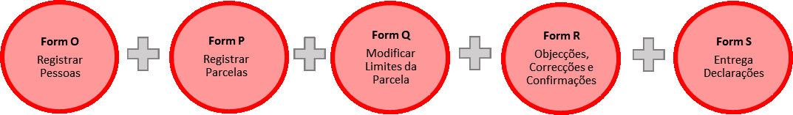

# Formulários ODK

## Formulário O: Registrar Pessoas

* Este formulário esta utilizado para gravar informação das pessoas que querem fazer registo das suas terras familiares ou individuais. 
* O\(s\) titulares tem que trazer os documentos da identificação.

## Formulário P: Registrar Parcelas

* Este formulário esta utilizado para identificar as parcelas que serão certificadas pela associação.
* O técnico usa o formulário para registar a forma de obtenção, o uso, os limites, os titulares e testemunhas.
* O formulário é usado junto com mapas para identificar os limites das parcelas.

## Formulário Q: Modificar Limites duma Parcela

* Para modificar limites duma parcela já registada.

## Formulário R: Confirmação, Objecções e Correcções

* Para usar depois de conclusão do período do edital \(Objecções, Confirmações

   e Correcções\). O formulário esta usado para reportar:

* a confirmação da informação publicada no edital sobre os titulares e parcelas;
* a necessidade de mudar a configuração dos limites duma parcela;
* a necessidade de mudar a informação dos titulares.

## Formulário S: Entrega das Declarações

* Para fazer registo de entrega de Declarações às associações. As associações são então responsáveis pela entrega das declarações aos titulares.

  .

