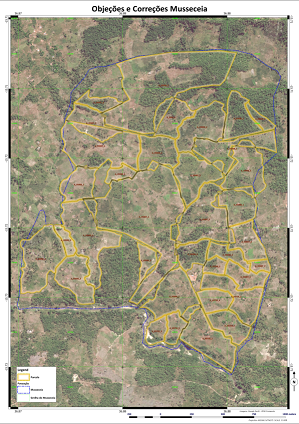
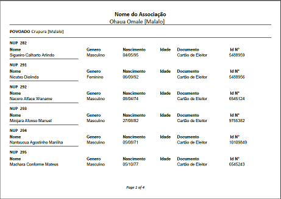

# Preparação de Edital

## Objectivo

Produzir mapas em tamanho A1 das parcelas individuais e/ou familiares e as listas com os nomes dos requerentes

## Processo

A equipa técnica do escritório produz um mapa geral das parcelas em formato A1 para facilitar a visualização, análise e validação pela comunidade durante a fase de Objecções e Correcções. A equipa técnica produz também uma lista de requerentes para a comunidade em tamanho A4, contendo informações relevantes sobre o requerente e a parcela.

As parcelas são enumeradas com base no Número Único da Parcela \(NUP\), que é o número que consta no recibo e que irá facilitar a localização e identificação da parcela no mapa pelo requerente.

> 
>
> 
>
> Exemplo do mapa e lista

## Ferramentas

* Dados submetidos através do Formulário K Registrar Pessoas CDUATs \(que fornece a lista de requerentes\)
* Dados submetidos através do Formulário L Registrar Parcelas CDUATs  \(que fornece a informação sobre as parcelas\)
* Mapas da série H com o desenho das parcelas individuais e/ou familiares

## Produtos

* Mapas tamanho A1 Objecções e Correcções
* Lista de requerentes 

