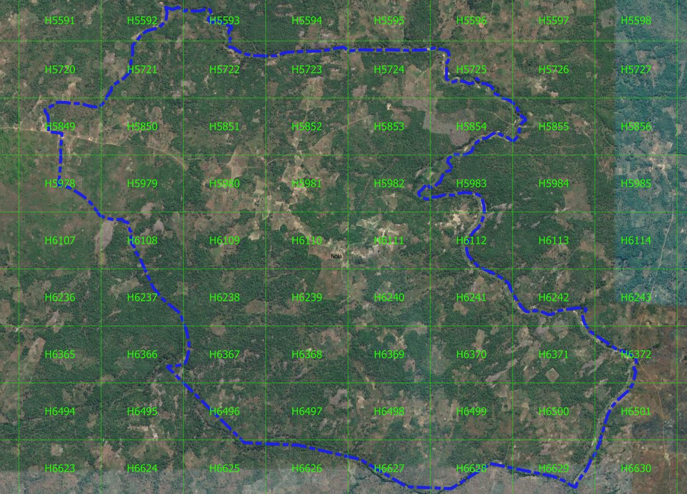

# Delimitação da Área Comunitária

Em paralelo com as actividades de mapeamento, a equipe vai trabalhar com os grupos da comunidade para realizar uma série de outras actividades que são mandatadas pelo Anexo Técnico sobre a delimitação de terras. Estas incluem:

* Compilação de informações sobre a história, contexto social e institucional da comunidade;
* Realização de caminhadas transversais para identificar e descrever os recursos naturais e padrões de uso da terra.

Mais uma vez, a equipa de facilitação será equipada com ferramentas para acompanhar sistematicamente a participação e os resultados dessas actividades, usando formulários no ODK. Estes formulários podem captar as datas de eventos, o número de participantes, a captura de dados geo-referenciados sobre os recursos e usos da terra, registro de dados sobre as instituições comunitárias, capturar fotografias de pessoas, lugares e eventos. Estes dados serão integrados no sistema de banco de dados e no Sistema de Informação Geográfica e ser utilizado em atividades subsequentes.

