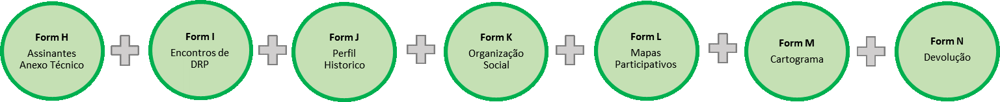

# Formulários ODK

## Formulário H: Assinantes do Anexo Técnico

* Para recolher informação dos membros que vão assinar os formulários do Anexo Técnico.
* Vai ser preenchido para cada membro. Pode ser preenchido e a informação enviada várias vezes, por exemplo o motivador pode enviar alguns nomes hoje e outros nomes amanhã.
* Tem que ser preenchido durante o encontro, porque requer assinaturas digitais e fotos dos membros fundadores e dos seus documentos da identificação.
* Será possível fazer registo de algumas pessoas num dia e enviar o formulário, e preencher um outro formulário H com membros adicionais da mesma associação.

## Formulário I: Encontros de Diagnóstico Rural Participativo

* Usado para capturar os detalhes de cada reunião realizada numa comunidade ou associação durante a fase de DRP. 
* Preencher na comunidade, incluindo foto e coordenadas. 

## Formulário J: Perfil Histórico

* Usado para registar informações sobre a história da comunidade e as datas de eventos importantes. 

## Formulário K: Organização Social

Usado para registar informações sobre a organização social da comunidade.

* Inclui fotos de dois diagramas:
  * diagrama de Venn: identifica comunidades vizinhas e organizações internas ou externas que são influentes na vida da comunidade
  * diagrama de estrutura de liderança: organograma que identifica a hierarquia dos líderes 

## Formulário L: Mapas Participativos

Usado para capturar imagens dos mapas participativos feitos pelas mulheres e homens. Preencher na comunidade no fim de trabalho

## Formulário M: Cartograma

Usado para capturar a imagem do cartograma. Preencher na comunidade no fim do encontro

## Formulário N: Devolução

Usado para capturar informação sobre os membros da associação que vão assinar o Formulário 5 de Anexo Técnico. Devem ser gravados pelo menos três representantes da comunidade e os representantes das comunidades vizinhas. Inclui fotos e assinaturas dos assinantes, representantes e facilitadores

