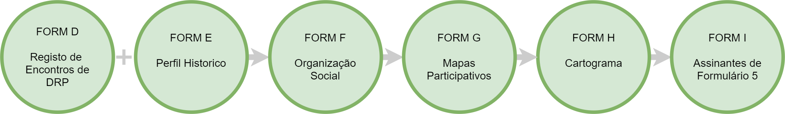

# Formulários ODK

## Formulário D: Encontros de Diagnóstico Rural Participativo

* Usado para capturar os detalhes de cada reunião realizada numa comunidade ou associação durante a fase de DRP. 
* Preencher na comunidade, incluindo foto e coordenadas. 

## Formulário E: Perfil Histórico

* Usado para registar informações sobre a história da comunidade e as datas de eventos importantes. 

## Formulário F: Organização Social

Usado para registar informações sobre a organização social da comunidade.

* Inclui fotos de dois diagramas:
  * diagrama de Venn: identifica comunidades vizinhas e organizações internas ou externas que são influentes na vida da comunidade
  * diagrama de estrutura de liderança: organograma que identifica a hierarquia dos lideres 

## Formulário G: Mapas Participativos

Usado para capturar imagens dos mapas participativos feitos pelas mulheres e homens. Preencher na comunidade no fim de trabalho

## Formulário H: Cartograma

Usado para capturar a imagem do cartograma. Preencher na comunidade no fim do encontro

## Formulário I: Devolução

Usado para capturar informação sobre os membros da associação que vão assinar o Formulário 5 de Anexo Técnico. Devem ser gravados pelo menos três representantes da comunidade e os representantes das comunidades vizinhas. Inclui fotos e assinaturas dos assinantes, representantes e facilitadores

