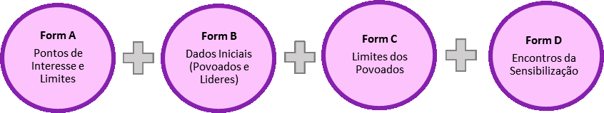

# Formulários ODK

## Formulário A: Pontos de Interesse e Limites

* Usar para gravar informação de pontos de interesse.
* Vai ser usado várias vezes em cada povoado, gravando informação dum ponto de interesse por cada vez.
* Tem que ser preenchido no local, porque requer uma foto e as coordenadas.

## Formulário B: Dados Iniciais \(Povoados e Lideres\)

* Usar para capturar informação sobre o povoado e seus lideres.
* Vai ser usado várias vezes em cada povoado.
* Tem que ser preenchido no local, porque requer uma foto da pessoa, fotos do documento da identificação e as coordenadas.

## Formulário C: Limites dos Povoados

* Usa-se junto com os mapas para identificar limites dos povoados.
* Semelhante com delimitação de parcelas:
  * Onde vê-se bem no mapa \(p.e. rios\), desenhar os limites directamente no mapa
  * Onde não é possível ver os limites, tem que caminhar e gravar coordenadas
* Pode começar a gravar algumas coordenadas, salvar e dia seguinte abrir e continuar com o processo de gravar mais coordenadas
* Depois de identificar todos os limites, tem que desenhar no mapa com marcador de cor vermelha, e tirar foto do mapa para incluir no formulário
* Tem que ser preenchido no local

## Formulário D: Registo de Encontros de Sensibilização

* Usar para gravar informação geral durante os encontros no processo de sensibilização
* Vai ser usado várias vezes em cada sitio onde haja actividades de

  sensibilização

* Tem que ser preenchido no fim do encontro, porque requer uma foto dos participantes e as coordenadas do encontro.

