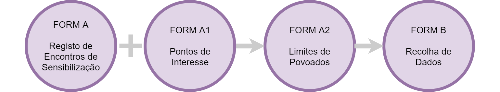

# Formulários ODK

## Formulário A: Registo de encontros de sensibilização

* Usar para gravar informação geral durante os encontros no processo de sensibilização
* Vai ser usado várias vezes em cada sitio onde haja actividades de 

  sensibilização

* Tem que ser preenchido no fim do encontro, porque requere uma foto dos participantes e as coordenadas do encontro.

## Formulário A1: Pontos mapeamento

* Usar para gravar informação de pontos de interesse, em particular antes ou depois de encontros.
* Vai ser usado várias vezes em cada povoado, gravando informação dum ponto de interesse por vez.
* Tem que ser preenchido no local, porque requere uma foto e as coordenadas.

## Formulário A2: Limites povoados

* Usa-se junto com os mapas para identificar limites dos povoados.
* Semelhante com delimitação de parcelas:
  * Onde vê-se bem no mapa \(p.e. rios\), desenhar os limites directamente no mapa
  * Onde não é possível ver os limites, tem que caminhar e gravar coordenadas
* Pode começar a gravar algumas coordenadas, salvar e dia seguinte abrir e continuar com o processo de gravar mais coordenadas
* Depois de identificar todos os limites, tem que desenhar no mapa com marcador de cor vermelha, e tirar foto do mapa para incluir no formulário
* Tem que ser preenchido no local

## Formulário B: Recolha de dados

